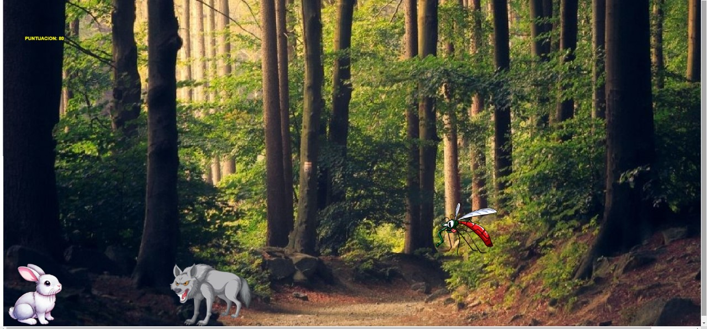

#  Bonnie 

UTN - Facultad Regional Buenos Aires - Materia Paradigmas de Programación

## Equipo de desarrollo: 

- Joaquin Burgio
- Maximiliano Alexander Vargas
- Lucas Fajardo
- Gonzalo Grillo
 
## Capturas 

## Reglas de Juego / Instrucciones

¡Bienvenido a **"Bonnie"**! Ayuda a nuestro valiente conejo a esquivar y recolectar objetos mientras avanza en su camino. Pero ten cuidado: ¡no todo lo que aparece es bueno! Tienes que reaccionar rápido para sobrevivir y ganar la mayor cantidad de puntos posible.

## Objetivo del Juego

Tu objetivo es avanzar lo más lejos posible mientras esquivas objetos peligrosos y recoges monedas para sumar puntos. ¡Recuerda, todo puede pasar en cualquier momento!

## Objetos que encontrarás

1. **Lobo (Malo)**  
   - **Efecto**: Si chocas con un lobo, el juego termina de inmediato. ¡Cuidado!  
   - **Consejo**: ¡Esquívalo a toda costa!

2. **Mosquito (Malo)**  
   - **Efecto**: Si chocas con un mosquito, perderás **4 puntos**.  
   - **Consejo**: A veces es mejor dejarlo pasar que arriesgarse.

3. **Moneda Dorada (Buena)**  
   - **Efecto**: Si chocas con una moneda dorada, ganarás **8 puntos**.  
   - **Consejo**: ¡Aprovecha cada oportunidad para coleccionar monedas!

4. **Escudo Azul (Beneficioso)**  
   - **Efecto**: Si chocas con un escudo azul, tu conejo se vuelve **inmune durante 7 segundos**. Durante este tiempo, no puedes ser dañado por ningún objeto malo.  
   - **Consejo**: Usa el escudo para atravesar zonas peligrosas con seguridad.

5. **Alas (Beneficioso)**  
   - **Efecto**: Si chocas con unas alas, tu conejo ganará la habilidad de **doble salto durante 7 segundos**.  
   - **Consejo**: El doble salto es ideal para esquivar obstáculos altos o saltar a zonas difíciles de alcanzar.

## Importante sobre los efectos de los objetos

- Si obtienes tanto el **escudo azul** como las **alas** en el mismo juego, solo se aplicará el último efecto que hayas recogido. ¡Elige bien qué objeto recoger!
- Se pierde inmunidad al saltar

## Reglas Básicas

- Esquiva el **lobo** a toda costa, ya que un choque con él terminará el juego.
- Si tocas el **mosquito**, perderás puntos, pero no terminarás el juego.
- Intenta recolectar las **monedas doradas** para sumar puntos.
- Usa el **escudo azul** y las **alas** estratégicamente para mejorar tu rendimiento y evitar daños.

## Puntaje

- **Moneda dorada**: +8 puntos  
- **Mosquito**: -4 puntos  
- **Lobo**: Fin del juego  

## Consejos

- Siempre mantén los ojos bien abiertos: los objetos caen rápido y a veces no hay tiempo para pensar.
- Aprovecha el **doble salto** para evitar obstáculos o alcanzar objetos difíciles de conseguir.
- El **escudo azul** es una gran herramienta para atravesar zonas llenas de objetos peligrosos sin riesgo.

## ¡Desafía a tus amigos y demuestra quién es el mejor esquivador de conejos!

## Controles:

- **Flecha arriba**: Saltar
- **Letra P **: Pausar musica

